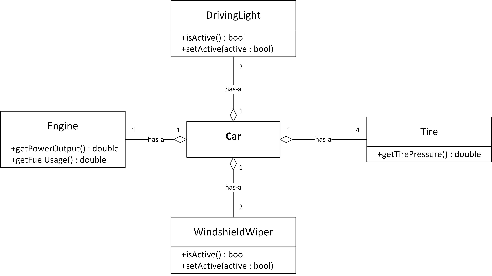

## Q. 자동차 레이싱 게임을 만든다고 하자. 우선 자동차에 대한 모델링부터 해야 한다. 자동차 종류가 단 하나라고 할 때 아래의 조건들을 만족하도록 자동차 설계를 제시하고 그 이유를 설명해보아라.

- 자동차의 인스턴스마다 엔진의 현재 출력, 현재 연비, 타이어 공기압, 전조등 On/Off, 와이퍼 작동 여부 등과 같은 속성을 관리해야 한다.
- 플레이어는 자기 차의 엔진과 타이어와 전조등, 와이퍼 등을 얼마든지 원하는 대로 설정할 수 있다.

---

## mySolution

## authorSolution

It's clear that a car is not an engine, or a tire, or a driving light.
So, the car and its components should be modeled with has-a relationships. A car has an engine, it has (usually) four tires, it has driving lights, it has windshield wipers, and so on.
For the game, there will be an Engine class modelling the engine and keeping track of its current power output and its fuel usage. A Tire class models a single tire and keeps track of its pressure. A DrivingLight class models a single driving light, and a WindshieldWiper class models a single windshield wiper. Finally, the Car class then contains one instance of Engine, four instances of Tire, two instances of DrivingLight, and two instances of WindshieldWiper.
See the class diagram in 05-1.png.