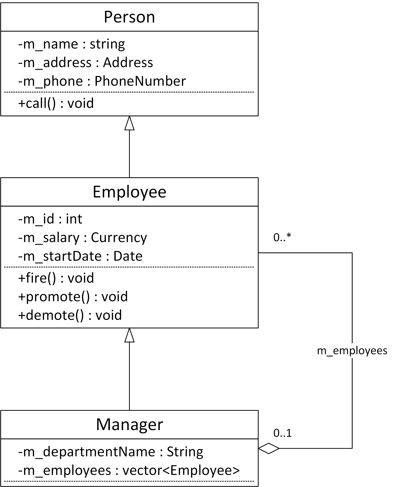

## Q. 연습문제 5-3에서 완성한 클래스 다이어그램을 토대로 몇 가지 동작과 속성을 추가해보자. 매니저가 팀원을 관리한다는 사실도 반영해보자.

---

## Solution.

See the class diagram in 05-4.png.
That's just one example that includes a set of properties and behaviors.
Of course, yours can be different.

The fact that a manager has a team of employees is modelled using a has-a relationship towards Employee.
Also note that not all employees have a manager, for example, the CEO doesn't have any manager.