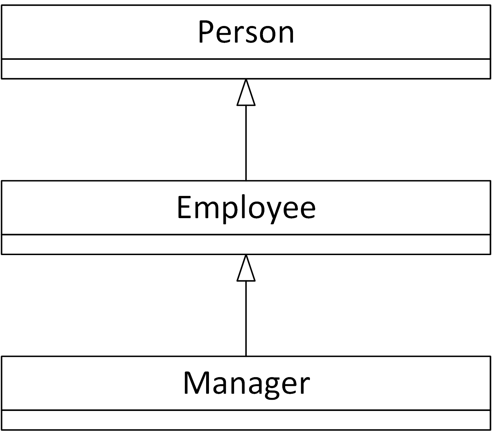

## Q. 인사팀 애플리케이션에 다음과 같은 세 가지 클래스가 있다고 하자. 

- Employee: 직원 ID, 연봉, 입사일 등을 관리한다.
- Person: 이름과 주소를 관리한다.
- Manager: 팀원을 관리한다.

---

## Solution.

다중 상속은 가능하면 피하는 것이 좋다. Person에 추가로 속성 및 메서드를 추가하여 
Employee 클래스를 만들고 Employee 클래스에 추가 작업을 하여 Manager 클래스를 만들 수 있다.